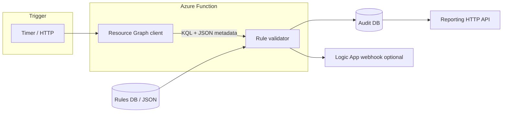

# Compliance Scanner POC (Azure Resource Graph)

Proof of concept for automated compliance scanning: **KQL → Azure Resource Graph → validate against rules → audit store → optional alerts/reporting**, aligned with the reference architecture.

## Architecture (POC scope)



## Prerequisites

- Node.js 18+
- [Azure Functions Core Tools](https://learn.microsoft.com/azure/azure-functions/functions-run-local) v4
- Azure subscription with **Reader** (Resource Graph) and identity for the function (Managed Identity or `az login` locally)
- Optional: Azure SQL Database for rules and audit

## Quick start (local)

1. Copy settings and sign in:

   ```powershell
   cd src\ComplianceScanner
   copy local.settings.json.example local.settings.json
   az login
   ```

2. Install dependencies:

   ```powershell
   npm install
   ```

3. Run the function app:

   ```powershell
   npm start
   ```

4. Trigger a scan (include `code` query param or `x-functions-key` when using function-level auth):

   ```powershell
   curl http://localhost:7071/api/scan
   ```

   Or run without the Functions host:

   ```powershell
   npm run scan
   ```

   Or wait for the timer (default: daily at 02:00 UTC).

## Configuration (`local.settings.json`)

| Setting | Description |
|--------|-------------|
| `FUNCTIONS_WORKER_RUNTIME` | Must be `node` |
| `AZURE_SUBSCRIPTION_ID` | Subscription to scan |
| `RULES_SOURCE` | `json` (default) or `sql` |
| `RULES_JSON_PATH` | Path to rules file when `RULES_SOURCE=json` |
| `SQL_CONNECTION_STRING` | Required when `RULES_SOURCE=sql` or `AUDIT_STORAGE=sql` |
| `AUDIT_STORAGE` | `memory`, `jsonfile`, or `sql` |
| `LOGIC_APP_WEBHOOK_URL` | Optional POST URL for compliance alerts |

## Resource Graph (KQL)

Sample queries live in [`queries/`](queries/). The scanner runs each rule’s `kql` (with `{subscriptionId}` replaced) and validates returned rows with `checks` (JSON path–style property expectations).

Example rule-driven query (all VMs in subscription):

```kusto
Resources
| where subscriptionId == '{subscriptionId}'
| where type == 'microsoft.compute/virtualmachines'
| project id, name, resourceGroup, subscriptionId, properties, tags, location
```

## Database setup (Azure SQL)

Run scripts in order:

1. [`database/01_rules_schema.sql`](database/01_rules_schema.sql)
2. [`database/02_audit_schema.sql`](database/02_audit_schema.sql)
3. [`database/03_seed_rules.sql`](database/03_seed_rules.sql)

Set `RULES_SOURCE=sql` and `AUDIT_STORAGE=sql` with your connection string.

## Deploy to Azure (outline)

1. Create Function App (**Node.js 18+**), enable system-assigned managed identity.
2. Grant identity **Reader** on the subscription (Resource Graph).
3. Create Azure SQL; run database scripts; store connection string in Key Vault; reference from app settings.
4. Deploy: `func azure functionapp publish <app-name>`
5. Optional: Logic App with **When a HTTP request is received** → email/Teams; set `LOGIC_APP_WEBHOOK_URL`.

## Project layout

```
src/ComplianceScanner/     Azure Functions app (Node.js)
  src/index.js               Timer + HTTP triggers
  src/compliance/            Resource Graph, validation, audit
database/                    SQL schemas and seed data
queries/                     Reference KQL
rules/compliance-rules.json  Default rules (local POC)
```

## Tests

```powershell
npm test
```

## Extending the POC

- Add Web App front end calling `GET /api/report/latest`.
- Wire Azure Monitor / Application Insights (enabled by default in Azure).
- Replace JSON rules with Policy-as-code or Azure Policy compliance export.
