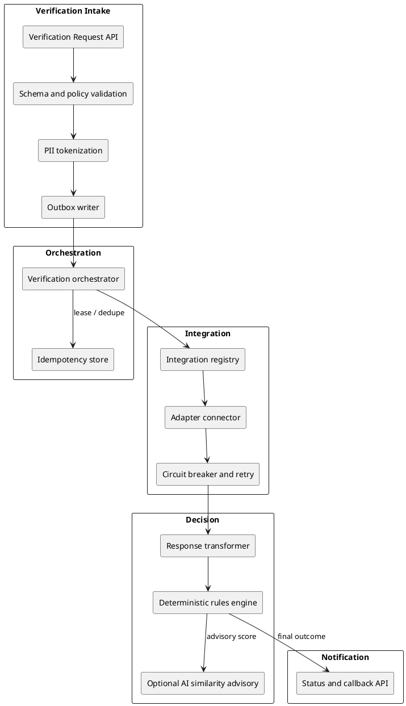

# UIDAI Demographic Verification Platform — High-Level Design

**Document version:** 1.0  
**Audience:** Architecture review / technical evaluation  
**Scope:** Design and approach demonstration (not full production implementation)

---

## 1. What the evaluation expects

The assignment is **not** primarily about building every integration or UIDAI production cutover. Reviewers are measuring whether a candidate can:

| Evaluation lens | What “good” looks like |
|-----------------|------------------------|
| **Scale & availability** | Design for **~1M verifications/day**, multi-zone resilience, autoscaling, back-pressure, and clear capacity assumptions. |
| **DDD & microservices** | Bounded contexts (intake, orchestration, integration, decision, notification), clear aggregates, events, and idempotent workflows. |
| **Metrics, monitoring, health** | SLIs/SLOs, structured business events, distributed tracing, health probes, runbooks—not only infra metrics. |
| **REST & contracts** | Canonical APIs in **OpenAPI 3.0**; external provider variance hidden behind adapters. |
| **CI/CD & DevOps** | Pipeline stages, IaC, secrets, progressive rollout, contract tests, chaos/resilience tests in CI where feasible. |
| **HLD quality** | Traceability from objectives → components → NFRs → ops model. |
| **Security & PII** | No clear-text PII at rest; tokenization/vault; least privilege; audit without exposing payload. |
| **Zero/low-code expansion** | New state/registry onboarding via **configuration** (registry metadata, mappings, auth profiles)—not redeploy of core code. |
| **Reliability** | **No lost requests** (outbox + durable queue + idempotency + DLQ). |
| **AI (optional)** | AI assists; **deterministic** platform owns the final decision and audit trail. |

**Deliverables mapping**

| # | Deliverable | This package |
|---|-------------|--------------|
| 3.1 | High-level design | Sections 2–9 and architecture plan (Section 3) |
| 3.2 | API specs (OpenAPI 3.0 style) | Section 12 — REST contracts in this document |
| 3.3 | Resiliency demonstration | Section 10 (pseudo-code) |
| 3.4 | Probabilistic AI in deterministic platform | Section 11 |

---

## 2. Problem statement (condensed)

UIDAI must verify **demographic attributes** (name, DOB, gender, address) submitted during enrolment/update against **100+ external registries** (states, central departments, DigiLocker), each with:

- Different **API shapes** and **authentication**
- Different **semantic models** (e.g. single `name` vs `surname` + `givenName`; date formats)

The platform must scale, onboard new integrations with minimal code change, survive partner outages, never lose a request, protect PII, and support observability—with optional AI for fuzzy matching under **deterministic** governance.

---

## 3. Architecture plan

**Yes — you can use the architecture diagram you prepared as the official architecture plan for this submission.** Insert it in this section (PDF/Word export will include it if the image file sits beside this document or you paste it into the exported doc).

Save your diagram as:

`docs/images/uidai-demographic-verification-architecture.png`

Then ensure the line below points to that file (or paste the image directly into Word when submitting):


The diagram depicts: **Azure Front Door / APIM** (edge) → **Validation Function** (schema check, PII tokenization) → **Azure SQL** (request + **outbox**) → **Outbox publisher** → **Service Bus** → **AKS** (orchestrator, adapter/connector, response transformer, decision service, optional AI) backed by **Integration Registry** (App Configuration / SQL), **Key Vault**, **Blob/SQL** stores, and **Azure Monitor / Application Insights / Log Analytics**.

### 3.1 Mapping requirements to the architecture

| Requirement | How the diagram addresses it |
|-------------|------------------------------|
| 100+ API integrations | APIM + scalable AKS adapters + registry-driven connectors |
| Zero/low-code new registries | Integration Registry (definitions, mappings, auth profiles, resilience policy) |
| ~1M transactions/day | Service Bus + KEDA-scaled AKS + Azure SQL PaaS (see Section 8) |
| Resilience to partner outages | Retries, timeouts, circuit breakers, DLQ, multi-zone AKS |
| No enrolment request lost | Transactional **outbox** + durable messaging + idempotent processing |
| No clear-text PII | Tokenization at intake, Key Vault, encryption at rest |
| Low-maintenance data store | Managed Azure SQL (+ Blob for large artifacts) |
| Monitoring and analytics | Monitor, App Insights, Log Analytics, business events |
| Optional AI | Advisory AI service; deterministic decision (Section 11) |

### 3.2 Design refinements (companion to the diagram)

These are brief written additions reviewers often expect alongside the picture:

1. **DDD:** Canonical **VerificationRequest** vs per-registry **anti-corruption** adapters (Section 5).  
2. **APIM:** Per-partner rate limits, OAuth/mTLS, log sanitization (no PII in traces).  
3. **DR:** RPO/RTO for SQL and Service Bus; geo-redundancy where mandated.  
4. **Data residency:** India region deployment; retention policy for tokens and audit.  
5. **Ambiguous outcomes:** `INCONCLUSIVE` path to manual review when rules/AI do not meet thresholds.

**Conclusion:** The shared architecture diagram **fits the UIDAI brief**; this document supplies narrative, APIs, resilience, and AI governance around that plan.

---

## 5. Domain-driven design — bounded contexts



| Context | Aggregate / entity | Responsibility |
|---------|-------------------|----------------|
| **Intake** | `VerificationRequest` | Accept enrolment correlation id, validate, tokenize PII, persist encrypted payload + outbox row. |
| **Orchestration** | `VerificationJob` | Drive state machine; enforce idempotency key; publish/consume messages. |
| **Integration** | `IntegrationDefinition` | Endpoint, auth profile, timeouts, mappings, circuit breaker config. |
| **Decision** | `VerificationOutcome` | Normalize provider response; apply rules; optional AI score; final status. |
| **Notification** | `DeliveryAttempt` | Callback/webhook/poll status to originating portal. |

**Ubiquitous language (examples):** `EnrolmentReferenceId`, `RegistryCode`, `CanonicalPerson`, `MatchConfidence`, `FinalDecision` (enum: `MATCH`, `MISMATCH`, `INCONCLUSIVE`, `UNAVAILABLE`).

---

## 6. Logical architecture (Azure)

Aligns with the submitted diagram:

| Layer | Components |
|-------|------------|
| **Edge** | Azure Front Door (WAF), Azure API Management (external API, throttling, OAuth/mTLS) |
| **Intake** | Azure Function: validation + tokenization; Azure SQL: request + outbox tables |
| **Messaging** | Azure Service Bus (queues/topics); dead-letter queues |
| **Processing** | AKS: Orchestrator, Adapter, Transformer, Decision, optional AI; **KEDA** on queue depth |
| **Configuration** | Azure App Configuration + SQL registry (integration definitions, mapping JSON) |
| **Secrets** | Azure Key Vault (Managed Identity); no secrets in config plaintext |
| **Data** | Azure SQL (transactional), Blob (optional payload snapshots, encrypted) |
| **Observability** | Application Insights, Log Analytics, Azure Monitor alerts, custom business events |

---

## 7. Core flows

### 7.1 Submit verification (synchronous accept)

1. Partner calls `POST /v1/verifications` via APIM.  
2. Intake validates OpenAPI schema and mandatory enrolment reference.  
3. PII fields encrypted/tokenized; **only tokens + enrolment metadata** stored in SQL.  
4. Row inserted: status `ACCEPTED`; outbox row `PENDING` in **same transaction**.  
5. HTTP **202 Accepted** with `verificationId` and status URL.

### 7.2 Async processing

1. Outbox publisher (Function or worker) reads outbox, publishes to Service Bus, marks outbox `PUBLISHED`.  
2. Orchestrator consumes message (idempotent on `verificationId`).  
3. Adapter loads `IntegrationDefinition` for `registryCode`; maps canonical → provider request; calls external API with retry/circuit breaker.  
4. Transformer maps provider → canonical result.  
5. Decision service applies rules; optionally calls AI for similarity score.  
6. Persist outcome; emit analytics event; notify via callback/status API.

### 7.3 Zero / low-code onboarding

New registry = new row in **Integration Registry** (no core redeploy):

- `registryCode`, OpenAPI fragment or WSDL reference, auth type (OAuth2, mTLS, API key)  
- JSON **field mappings** (canonical ↔ provider)  
- Retry, timeout, circuit breaker thresholds  
- Optional test harness in CI using recorded fixtures  

Promotion: config change via PR → automated contract tests → App Configuration label swap.

---

## 8. Non-functional design (1M/day)

**Assumptions (adjust in review):**

- Avg payload ~2 KB; peak **2×** daily average over 4 hours → ~58 msg/sec average peak ~115 msg/sec.  
- Service Bus Premium or partitioned Standard with multiple queues by registry tier.  
- AKS: KEDA scales adapter/orchestrator pods on queue length; min replicas > 0 in peak regions.  
- SQL: Business Critical tier, read scale-out for reporting; partition old jobs to archive table/Blob.  
- APIM: Per-partner rate limits; caching only for **non-PII** metadata if ever needed.

**SLO examples**

| SLI | Target |
|-----|--------|
| Intake availability | 99.95% |
| Time to accept (202) | p99 < 500 ms |
| End-to-end verification (excl. partner) | p95 < 30 s |
| Zero data loss | Outbox + SB duplicate detection + idempotency |

---

## 9. Security & PII

- **In transit:** TLS 1.2+ end-to-end; mTLS to selected government endpoints.  
- **At rest:** SQL TDE + CMK in Key Vault; application-level encryption for demographic tokens.  
- **Logging:** Structured logs with **correlation id only**; no clear-text name/DOB in App Insights.  
- **Identity:** Managed Identity for all Azure resources; RBAC; private endpoints for SQL/Service Bus/Key Vault.  
- **Audit:** Immutable audit trail of decisions (who/what/when), not raw PII.

---

## 10. Resiliency demonstration (pseudo-code)

Deliverable **3.3** — patterns: **transactional outbox**, **retry with backoff**, **circuit breaker**, **idempotency**, **DLQ**.

### 10.1 Transactional outbox (no lost request)

```text
BEGIN TRANSACTION
  INSERT VerificationRequest (id, enrolmentRef, encryptedPayload, status='ACCEPTED')
  INSERT Outbox (id, verificationId, eventType='VerificationRequested', payloadRef, status='PENDING')
COMMIT

LOOP outbox publisher (every N seconds OR change feed):
  batch = SELECT TOP 100 FROM Outbox WHERE status='PENDING' ORDER BY createdUtc
  FOR EACH row IN batch:
    TRY
      ServiceBus.send(row.toMessage())
      UPDATE Outbox SET status='PUBLISHED', publishedUtc=now() WHERE id=row.id
    CATCH
      -- leave PENDING; retry with exponential backoff; alert if age > threshold
    END
END
```

### 10.2 Orchestrator idempotency

```text
ON message M(verificationId):
  IF EXISTS ProcessingLease(verificationId) WITH valid lease:
    RETURN ack  // duplicate delivery
  ACQUIRE lease(verificationId, ttl=5min)
  TRY
    job = LoadJob(verificationId)
    IF job.state IN (COMPLETED, FAILED): RETURN ack
    Transition job -> IN_PROGRESS
    result = Adapter.verify(job)
    Decision.apply(job, result)
    job.state = COMPLETED
  FINALLY
    RELEASE lease
  END
```

### 10.3 Adapter: retry + circuit breaker (partner outage)

```text
FUNCTION callRegistry(registryCode, request):
  cfg = Registry.load(registryCode)
  IF CircuitBreaker.isOpen(registryCode):
    RETURN Outcome.UNAVAILABLE("registry circuit open")

  attempt = 0
  WHILE attempt < cfg.maxRetries:
    TRY
      response = HttpClient.post(cfg.url, auth=cfg.auth, body=MapToProvider(request),
                                timeout=cfg.timeoutMs)
      CircuitBreaker.recordSuccess(registryCode)
      RETURN MapToCanonical(response)
    CATCH TransientError AS e:
      CircuitBreaker.recordFailure(registryCode)
      attempt++
      SLEEP backoff(attempt, cfg.baseDelayMs)
    CATCH PermanentError AS e:
      RETURN Outcome.FAILED(e.code)
    END
  END
  RETURN Outcome.UNAVAILABLE("retries exhausted")
```

### 10.4 Dead-letter and replay

```text
ON ServiceBus message moved to DLQ:
  Emit alert metric dlq_depth++
  Store DLQ metadata (verificationId, reason, timestamp) in ops table

OPERATOR replay(verificationId):
  IF manual approval AND NOT duplicate completed job:
    Requeue with same verificationId (idempotent handler safe)
```

---

## 11. Probabilistic AI in a deterministic platform (Deliverable 3.4)

### 11.1 Principle

The platform’s **system of record** is deterministic: every verification ends in a defined **`FinalDecision`** with a **rule-based explanation** suitable for audit. AI models produce **scores or suggestions**, never unchecked final authority for regulated outcomes.

### 11.2 Where AI helps

| Use case | AI role | Deterministic gate |
|----------|---------|-------------------|
| Name similarity | Embedding or fuzzy match score 0–1 | Rules: if score ≥ T_high → MATCH; if ≤ T_low → MISMATCH; else INCONCLUSIVE |
| Address normalization | Parse/unstructured → structured suggestion | Compare normalized tokens with rule engine; reject AI-only match |
| Anomaly detection | Flag unusual patterns | Route to manual queue; do not auto-fail enrolment |

### 11.3 Control model

1. **Versioned models** in Azure ML / Azure OpenAI with deployment slots; config names model version per environment.  
2. **Fixed prompts/templates** stored in registry; changes require approval workflow.  
3. **Temperature = 0** (or non-generative models) for scoring tasks; no free-form text in decision path.  
4. **Dual record:** store `aiScore`, `modelVersion`, `inputTokenHash`—not raw PII in model logs.  
5. **Fallback:** if AI unavailable, fall back to deterministic string metrics (Levenshtein, phonetic) or `INCONCLUSIVE`.  
6. **Human-in-the-loop:** `INCONCLUSIVE` → case queue; human action logged as override with reason code.

### 11.4 Audit narrative (example)

> Decision `MISMATCH` because rule R-NAME-02: provider surname token match failed after canonicalization; AI name similarity 0.72 below threshold 0.85 (model `name-sim-v3`, no override).

### 11.5 Testing AI in CI

- Golden fixtures with expected score bands (not exact floats).  
- Bias/regression suite when model version changes.  
- Shadow mode: AI runs in parallel without affecting decision until promoted.

---

## 12. REST API specification (Deliverable 3.2)

The evaluation asks for **OpenAPI 3.0–style** API definitions. Below is the contract in document form (paths, methods, schemas). If reviewers require a separate `.yaml` file, the same content can be transcribed to OpenAPI without changing the design.

### 12.1 Partner verification API (via APIM)

**Security:** OAuth 2.0 client credentials (or mTLS for government partners). Header **`Idempotency-Key`** required on submit.

| Method | Path | Description | Success |
|--------|------|-------------|---------|
| POST | `/v1/verifications` | Submit demographic verification | `202 Accepted` + `verificationId` |
| GET | `/v1/verifications/{verificationId}` | Poll status and outcome | `200 OK` |

**Request body (canonical model):**

| Field | Type | Required | Notes |
|-------|------|----------|-------|
| `enrolmentReferenceId` | string | Yes | Correlation to enrolment/update |
| `registryCode` | string | Yes | Routes to integration registry entry |
| `subject.fullName` | string | Yes | UIDAI single-field name |
| `subject.dateOfBirth` | date (ISO) | Yes | `YYYY-MM-DD` |
| `subject.gender` | enum | Yes | `M`, `F`, `T`, `O` |
| `subject.address` | object | No | line1, district, stateCode, pincode |
| `callbackUrl` | uri | No | HTTPS webhook on completion |

**Response (`202`):** `verificationId`, `status=ACCEPTED`, `statusUrl`.

**Status response:** `status` (`ACCEPTED`, `IN_PROGRESS`, `COMPLETED`, `FAILED`, `UNAVAILABLE`), optional `finalDecision` (`MATCH`, `MISMATCH`, `INCONCLUSIVE`, `UNAVAILABLE`), `decisionReasonCode`, optional `aiAdvisory` (score + model version only).

### 12.2 Integration registry API (internal, low-code)

Used by operations to onboard state/central/DigiLocker connectors **without redeploying** orchestrator code.

| Method | Path | Description |
|--------|------|-------------|
| GET | `/v1/integrations` | List registry definitions |
| POST | `/v1/integrations` | Create new registry |
| GET/PUT | `/v1/integrations/{registryCode}` | Read/update mapping and policies |

**IntegrationDefinition (key fields):** `registryCode`, `endpoint.baseUrl`, `endpoint.verifyPath`, `authProfile.type` (OAuth2, mTLS, API key, DigiLocker token), `authProfile.keyVaultSecretName`, `fieldMappings` (canonical JSON paths → provider fields), `resilience` (timeout, max retries, circuit breaker thresholds), link to **provider-specific** API description stored as an artifact per integration.

### 12.3 Callback webhook (optional)

Platform **POST**s to partner `callbackUrl` on terminal state with signed body (`X-Verification-Signature`: HMAC-SHA256). Payload includes `verificationId`, `enrolmentReferenceId`, `finalDecision`, `decisionReasonCode`, `completedUtc`—no clear-text PII.

### 12.4 External registry APIs

Each state/central/DigiLocker system keeps its **own** API contract. The adapter layer implements those contracts; only metadata and mapping rules live in the registry. Document each new integration with its provider spec attached to the registry record.

---

## 13. CI/CD and operations (summary)

| Stage | Activities |
|-------|------------|
| **Build** | Unit tests, lint, SAST, container scan |
| **Contract** | OpenAPI diff; pact tests for adapter mocks |
| **Deploy** | IaC (Bicep/Terraform): APIM, AKS, SB, SQL, Key Vault |
| **Verify** | Smoke tests, synthetic verification job, health endpoints |
| **Operate** | Dashboards: queue depth, error rate by registry, circuit state, p95 latency, DLQ count |
| **Resilience test** | Periodic fault injection (partner timeout simulator) in non-prod |

**Health endpoints:** `/health/live`, `/health/ready` (SQL, Service Bus, Key Vault reachable).

---

## 14. References

- Transactional Outbox pattern (Microsoft / microservices.io)  
- Azure Well-Architected Framework: Reliability, Security, Operational Excellence  
- OpenAPI 3.0 specification  

---

**Document owner:** Architecture candidate / project team  
**Status:** Draft for evaluation submission
